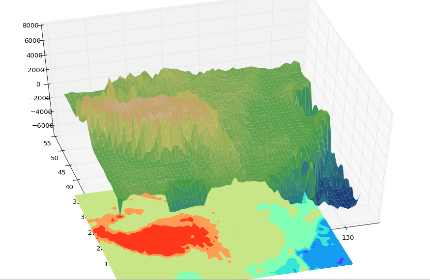

# GoogleMap_Python_API
Google Map Api with python Library —— ‘googlemap’，More Information please visit https://console.developers.google.com/apis and https://googlemaps.github.io/google-maps-services-python/docs/

# Snapshot


# Basic Usage

## Install:  
```pip install googlemaps```

## Instantiation   
```gmap = googlemaps.Client(key = "YOUR API_KEY HERE")```

## Geocoding human-readable address.   
### Return explicit imformation including (log,lat) coordinate tuple, detailed Address Name, ect.  
```Result = gmap.geocode("place names in string")```

## Return altitude information by given explicit coordinate info.   
```Result = gmap.elevation(location = (longtitude , latitude))```

## Search every possible location in a cicle under your restrictions   
```Result = gamp.places_radar(location = (longtitude,latitude) or "Address String", radius = Radius,min_price = [0-4], max_price = [0-4])```

# Notice  
This Api only permits 2500 Requests per user per day, which means it's hard to collect geo-info at 10k scale...  
Nervertheless, it's quite portable for scrabbling small-scale geo data.
